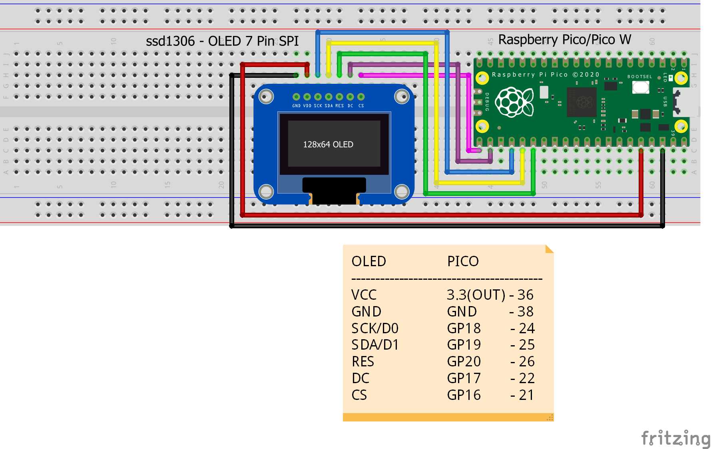
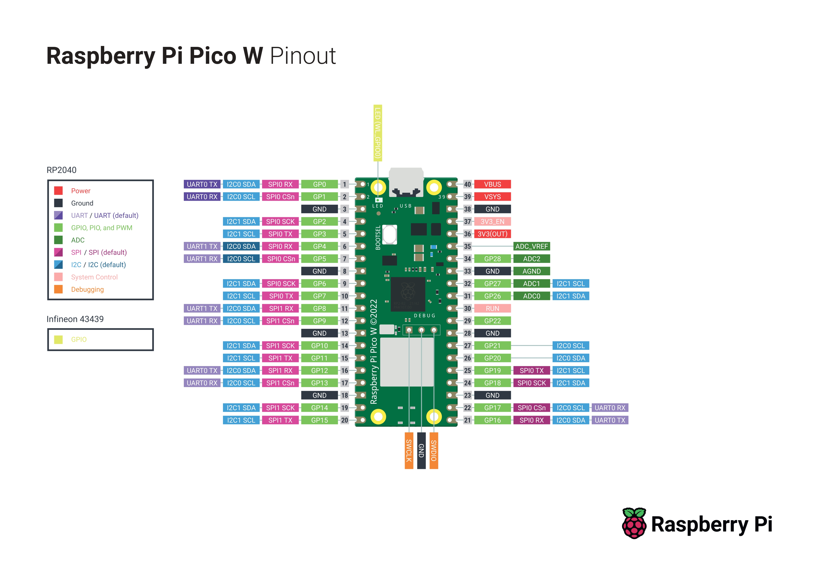

# OLED PICO W SHOW

Weird name but okay

## About

This is to learn and know how to display characters and images on ssd1306 oled 7 pin display using rapberry pico w

## Self note

The connection is a bit loose so the display turns on and very rarely doesn't, Don't panic just wiggle the wires around a bit

## Setup

Use the Setup folder files

1.  `setup/flash_nuke.uf2` to flash the pico
2.  `setup/micropython-firmware-pico-w-290622.uf2` to setup micro python in pico
3.  use Thonny to run the script into the pico

## Circuit Diagram

## References

[ssd1306-raspberry-pi-pico Article](https://techatronic.com/ssd1306-raspberry-pi-pico/)

[Install Thonny directly](https://thonny.org/)

[Install Scoop](https://scoop.sh/)

[Install Thonny Through Scoop](https://scoop.sh/#/apps?q=thonny)
